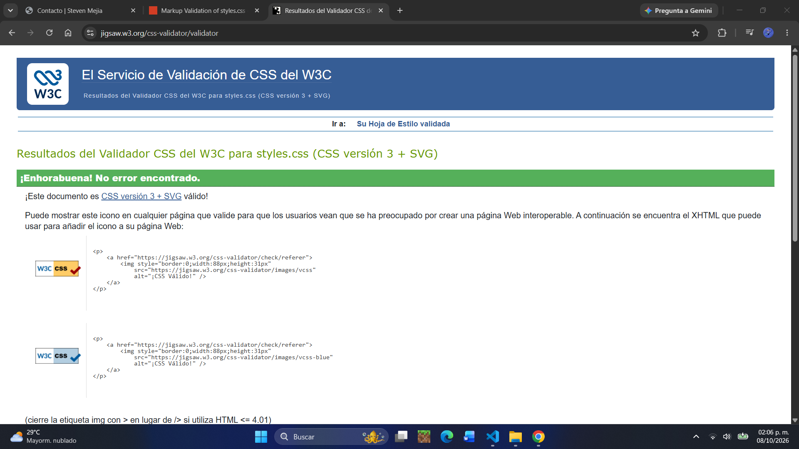

# Portafolio personal

Una página web para mi portafolio

**Sitio publicado:** https://stevenmejia-mx.github.io/portafolio/

## Objetivo
Este sitio se realizó en base a la Actividad 2 del Laboratorio de Programación Web, donde los requisitos eran armar un proyecto con HTML y CSS eligiendo un tipo de proyecto.

## Tecnologías
- HTML5 Semántico
- CSS3
- Flexbox
- Media queries
- Git y GitHub Pages

## Estructura del sitio
- **Inicio:** Lugar donde se muestra la información principal del portafolio.
- **Proyectos:** Lugar donde se encuentran los proyectos realizados a lo largo de mi carrera, esta sección corresponde a Servicios/Productos de la actividad.
- **Contacto:** Lugar que contiene los datos esenciales para contactarme, incluyendo un formulario maqueta por lo cual no tiene servidor.

## Capturas
### Vista de escritorio

### Vista móvil

## Resultados de validación
Los cuatro archivos del proyecto (los tres HTML y la hoja de estilos CSS) se validaron con los validadores del W3C, y ninguno presentó errores.

