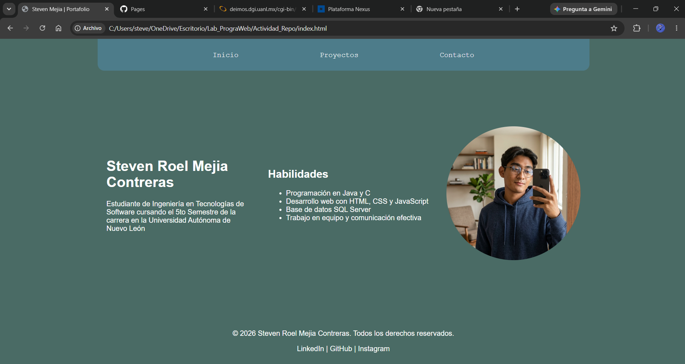
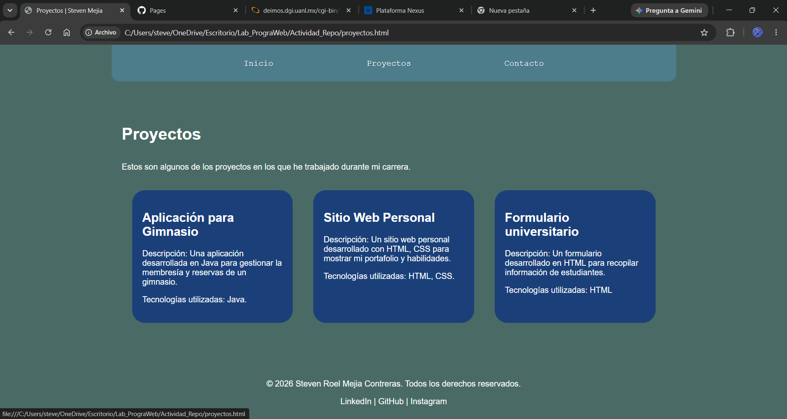
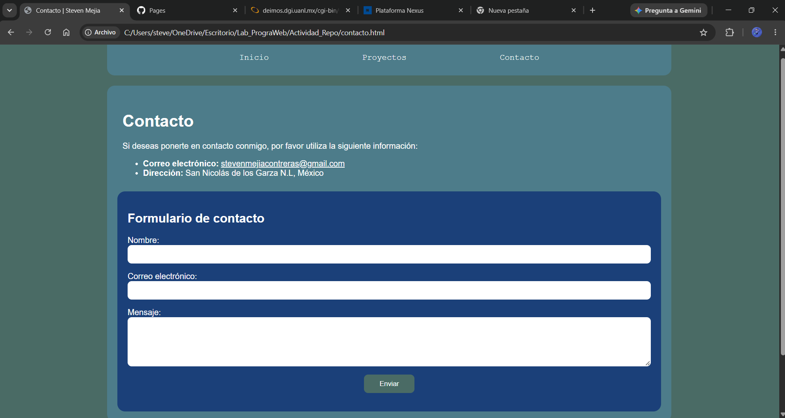
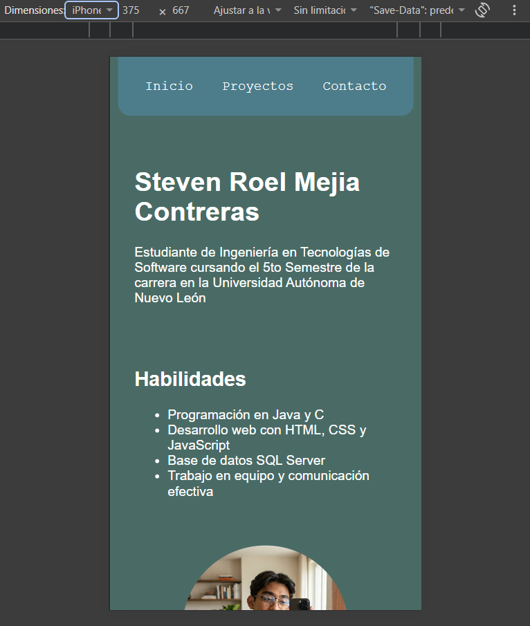
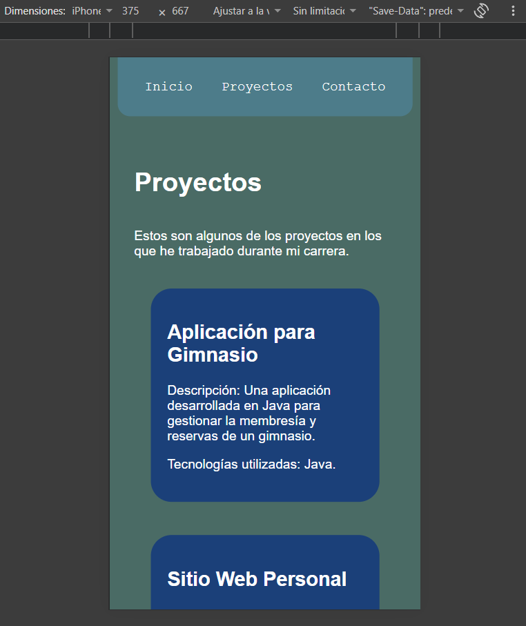
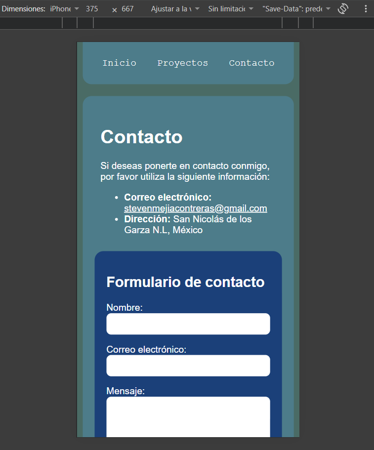
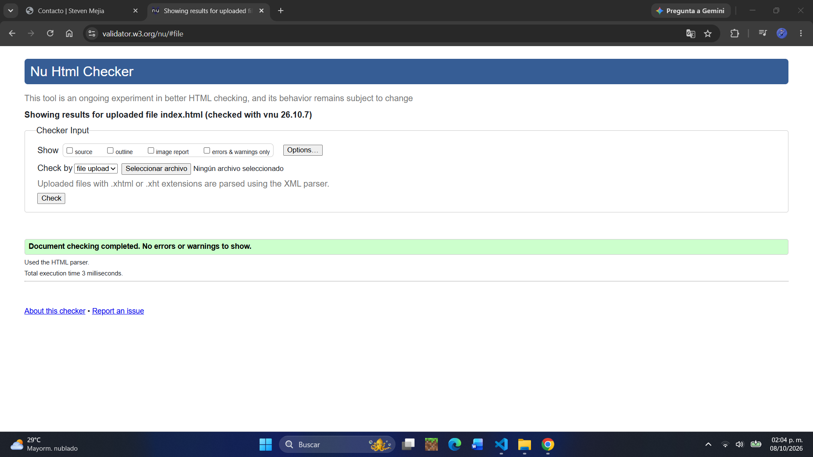
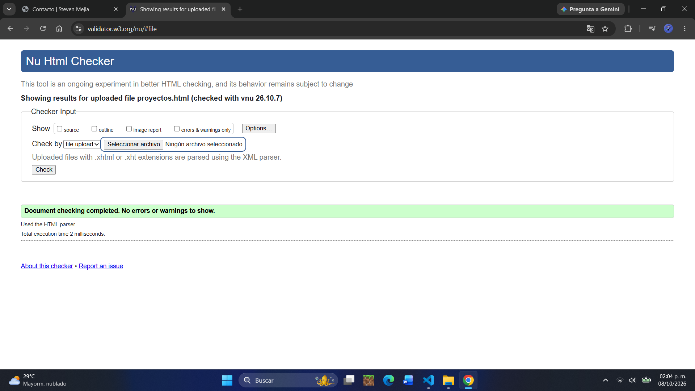

# [Portafolio personal]

[Una pagina web para mi portafolio]

**Sitio publicado:** [https://stevenmejia-mx.github.io/portafolio/]

## Objetivo
[Este sitio se realizo en base a la Actividad 2 del Laboratorio de Programación Web, donde los requisitos eran, armar un proyecto con HTML y CSS elijiendo un tipo de proyecto asignado por el profesor.]

## Tecnologías
- [HTML5 Semántico]
- [Flexbox]
- [Media queries]
- [Git y GitHub Pages]

## Estructura del sitio
- **Inicio:** [Lugar donde se muestra la informacion principal del portafolio.]
- **Proyectos:** [Lugar donde se encuentran los proyectos realizados a lo largo de mi carrera]
- **Contacto:** [Lugar que contiene los datos escenciales para contactarme, incluyendo un formulario maqueta por lo cual no tiene servidor]

## Capturas
### Vista de escritorio

### Vista móvil

## Resultados de validación

